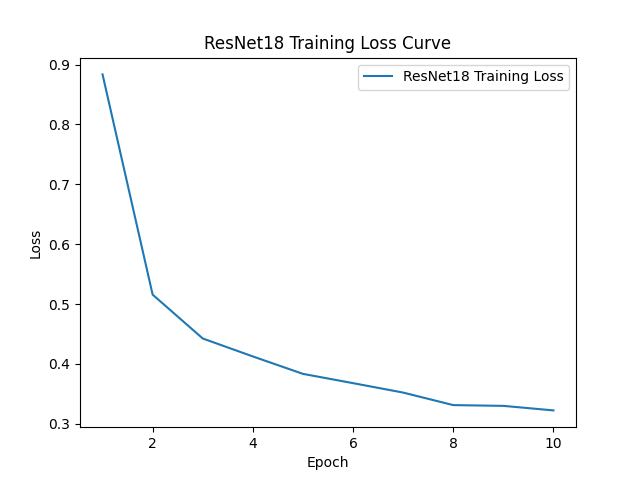

# ResNet18 vs Vgg16 for Sports Classifier

## Overview

This project focuses on training and inference for image classification using the sports dataset available <a href="https://www.kaggle.com/datasets/sidharkal/sports-image-classification" target="blank">here</a>. It provides functionality for training models (both Vgg16 and ResNet18) and conducting inference on test data. The project is organized into separate modules for learning and inference, with utility functions and command-line interface (CLI) options for customization.

  
  
  <h6 align="center">
    Losses curves (ResNet18 vs Vgg16)
  </h6>

## Requirements

- Python 3.10 or later
- Click
- PyTorch
